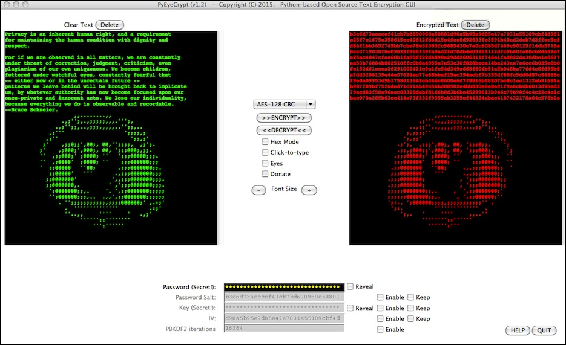

#**PyEyeCrypt**
---

Python-based Open Source Text Encryption GUI, with multiple ciphers e.g. aes 128.




**Checksums (v1.1):**

MD5 (PyEyeCrypt.py)                                    = 0cceaff22368c173469bf95506e701fc<br>
MD5 (aes.py)                                           = 0382f1d2ec99e4fa1078ebf2a9fa5698<br>
MD5 (pbkdf2.py)                                        = aafdc003eeebc03e9f747b24b9421408<br>
MD5 (executables/OSX_64bit/PyEyeCrypt.app.tgz)         = fec736a5a36db11cfa1e3ca6f1d91ee3<br>
MD5 (executables/Win7+_64bit/PyEyeCrypt.exe)           = 2c22acb00d452f702cb2b9210e511668<br>
MD5 (executables/ScientificLinux5.11_64bit/PyEyeCrypt) = 35ad9a6afee62930c9d3f203d21c6b11<br>
MD5 (executables/ScientificLinux6.6_64bit/PyEyeCrypt)  = 7e531fdb7d7cb4a0d3c94e25771b64de<br>
MD5 (keyblc\*.gif)                                     = df94e49c5ed49837b3c32b97d5fa2ad9<br>
MD5 (keybuc\*.gif)                                     = 96ad7e23452acec7f3ac7b435b4e7b45<br>

**OSX/Linux Usage:**

With Python (2.7.10/requires tkinter):<br>
```python PyEyeCrypt.py```

Without Python:<br>
Unix: ```./PyEyeCrypt``` <br>
(verified to work under Scientific Linux 5.11 / 6.6 (the 6.6 binary also works under Debian "jessie/sid").

OSX : Untar the .tgz file & drag the app onto your Dock, Desktop or wherever. Double-click.<br>
(should work on Snow Leopard and later)

**Windows:**

Simply download and double-click the ```PyEyeCrypt.exe``` file in the ```executables\\Win7+_64bit``` directory.

**'Naughty' Operating Systems:**

The new Windows 10 Privacy Statement includes the words:<br>
'Your typed and handwritten words are collected.'<br>

Windows is not alone in collecting private user data. Ubuntu's unity desktop also collected some user data and sent it to 'Cannonical'.<br>
This behaviour is akin to a keylogging virus.<br>

PyEyeCrypt will still run when keylogging is suspected, but ClearText and Passwords MUST be entered using the on-screen 'clickable' keyboards.

**Uninstall:**

Simply delete the downloaded files/directory. <br>
PyEyeCrypt does not create or store anything outside the directory in which it runs.